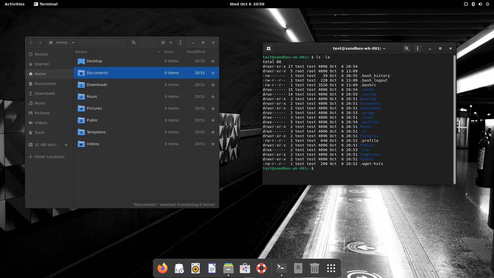

# Backup of my preferences

## Linux
[Debian Notes...](debianNotes.md)

## Text Editor
[Vim Notes...](vimNotes.md)

## Terminal
[Terminal Notes...](terminalNotes.md)

## Desktop


Download and run [gnome-prefs](https://github.com/paulondc/prefs/blob/master/gnome-prefs). You can get it by simply running the line bellow on the terminal :point_down:
```bash
echo 'cd $(mktemp -d) && wget --quiet https://raw.githubusercontent.com/paulondc/prefs/master/gnome-prefs && chmod +x gnome-prefs && ./gnome-prefs' | bash
```

## Extra goodies

#### Install debuggers:
```
sudo apt-get install lldb gdb
```

#### Install diff/history tools:
```
sudo apt-get install kdiff3 gitk
```

#### Git config defaults (`~/.gitconfig`):
```
[credential]
  helper = cache --timeout=36000000
[core]
  editor = nvim
[diff]
  guitool = kdiff3
[difftool "kdiff3"]
  trustExitCode = false
[difftool]
  prompt = false
```

## Licence
prefs is free software; you can redistribute it and/or modify it under the terms of the MIT License
