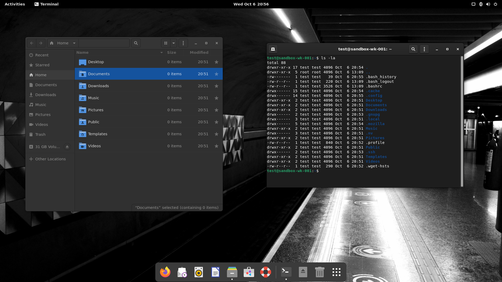

## Desktop

Download and run [gnome-prefs](https://github.com/paulondc/prefs/blob/master/gnome-prefs). You can get it by simply running the line bellow on the terminal :point_down:
```bash
echo 'cd $(mktemp -d) && wget --quiet https://raw.githubusercontent.com/paulondc/prefs/master/gnome-prefs && chmod +x gnome-prefs && ./gnome-prefs' | bash
```
